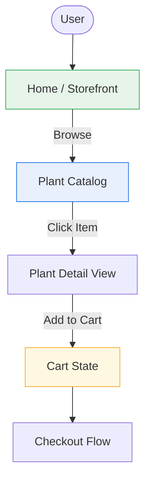

# 🌿 FloraVision

A modern, responsive web application for discovering and purchasing plants, providing a clean digital **Plant Store** experience.

**Live Deployment:** [floravision-iota.vercel.app](https://floravision-iota.vercel.app)

---

## Tech Stack

| Layer | Technology | Description |
|---|---|---|
| **Framework** | Next.js 14+ (App Router) | React framework providing file-based routing, server-side rendering (SSR), and optimized performance. |
| **Styling** | Tailwind CSS | Utility-first CSS framework for building highly customizable and responsive fluid layouts. |
| **Typography** | `next/font/google` | Next.js optimized font loading for the Inter typeface, preventing layout shift (CLS). |
| **Deployment** | Vercel | Edge network hosting platform ensuring fast global delivery and continuous integration. |
| **Core Language** | JavaScript / React | Component-based UI architecture utilizing modern React hooks. |

---

## Features

- 🌱 **Modern Storefront** — A clean, nature-inspired interface tailored for browsing botanical products
- 📱 **Fully Responsive** — Fluid design built with Tailwind CSS, ensuring a seamless shopping experience on mobile, tablet, and desktop
- ⚡ **Optimized Performance** — Fast page loads, smooth scrolling behaviors, and optimized font rendering
- 🧭 **Intuitive Navigation** — Seamless client-side routing utilizing the Next.js App Router ecosystem

---

## Project Structure

```
floravision/
├── src/
│   └── app/
│       ├── globals.css         # Global stylesheets & Tailwind directives
│       ├── layout.js           # Root layout, HTML skeleton, Inter font & metadata
│       ├── page.js             # Main landing page / Storefront UI
│       └── components/         # (Optional) Reusable UI components like Navbar, PlantCard
├── public/                     # Static assets (images, icons)
├── tailwind.config.js          # Tailwind theme and utility configuration
├── postcss.config.js           # PostCSS configuration for Tailwind
├── next.config.js              # Next.js compiler and build settings
└── package.json                # Project dependencies and scripts
```

---

## Architecture & Flow



---

## Data Models

> Conceptual representation for the frontend state

```
Store ──────────< Category >────────── Plant
                                        │
                                        └──── Cart Item
```

- A **Store** contains multiple **Categories** (e.g., Indoor, Succulents, Pet-Friendly)
- A **Category** has many **Plants**
- A **Plant** can be added to the user's session as a **Cart Item**

---

## Getting Started

```bash
# Clone the repository
git clone https://github.com/BhargavAdithya/floravision.git

# Navigate into the project
cd floravision

# Install dependencies
npm install

# Run the development server
npm run dev
```

Open [http://localhost:3000](http://localhost:3000) with your browser to see the application running.

> Edit `src/app/page.js` to see real-time updates!